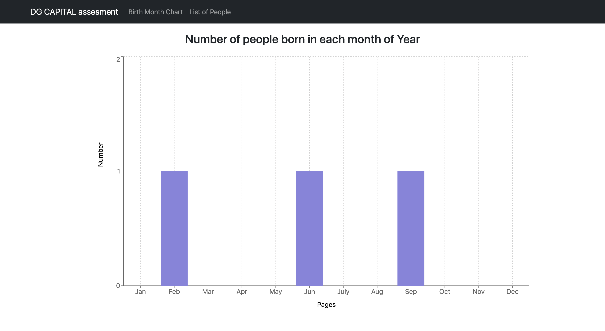

<h1 align="center">📊 Full Stack Application 📊</h1>
<h2 align="center"> DG Capital Full Stack Test - HR Management System</h2>

<p align="center"> Made in ReactJS, constructed with create-react-app, utilizing React Bootstrap, Node JS, Express & MySQL </p>
<p align="center">
  
  <a href="https://twitter.com/mrginolee" target="_blank">
    
  </a>
</p>

<h2 align="center">📈 <a href="https://ginoleeswan.github.io/dgcapital-assessment/">See Live</a> 📈</h2>

<p align="center">
  <a href="https://ginoleeswan.github.io/dgcapital-assessment/">
    
  </a>
</p>

<h2 align="right">📖 &nbsp; Lessons Learned</h2>

<div align="right">

&nbsp; Interesting & challenging project for DG Capital!\
&nbsp; My **Back-End** skills were put to the test.\
&nbsp; I had some basic experience with MySQL **databases** & queries.\
&nbsp; This was my first full attempt at creating a functioning **CRUD** application.

&nbsp; This project tested my skills in setting up a backend using NodeJS and Express utilizing MySQL.\
&nbsp; I had a minor stuggle with the **UPDATE/PUT call** to the MySQL server, especially updating **multiple columns** at once.\
&nbsp; After many visits to **stack overflow** I figured it out!.\
&nbsp; Implementing the **dynamic table** became simple as the API call data from the server was organized into a new array.

</div>

## 🔮 &nbsp; Future Features

- 📊 &nbsp; Implement more dynamic charts
- 👤 &nbsp; Add more attributes to back-end

<h2 align="right">🚀 &nbsp; Deployment</h2>
<div align="right">

Deployed with [Github Pages](https://ginoleeswan.github.io/dgcapital-assessment/)

</div>

## 🔨 &nbsp; Get Started

From your command line, first clone this repo:

```sh
# Clone this repository
$ git clone https://github.com/ginoleeswan/dgcapital-assessment/

# Go into the client repository
$ cd dgcapital-assessment/client

# Remove current origin repository
$ git remote remove origin
```

### Install

```sh
npm install
```

### Usage

```sh
npm run start
```

### Run tests

```sh
npm run test
```

<div align="right">

## ✍️ &nbsp; Author

👤 **Gino Swanepoel**

&nbsp; Twitter: [@mrginolee](https://twitter.com/mrginolee)\
 &nbsp; Github: [@ginoleeswan](https://github.com/ginoleeswan)\
 &nbsp; LinkedIn: [@ginoswanepoel](https://linkedin.com/in/ginoswanepoel)

</div>

## ❤️ &nbsp; Show your support

Give a ⭐️ if this project helped you!
